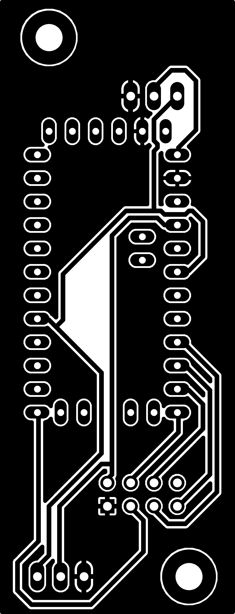
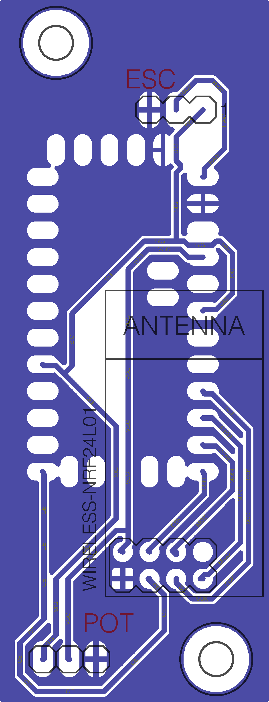
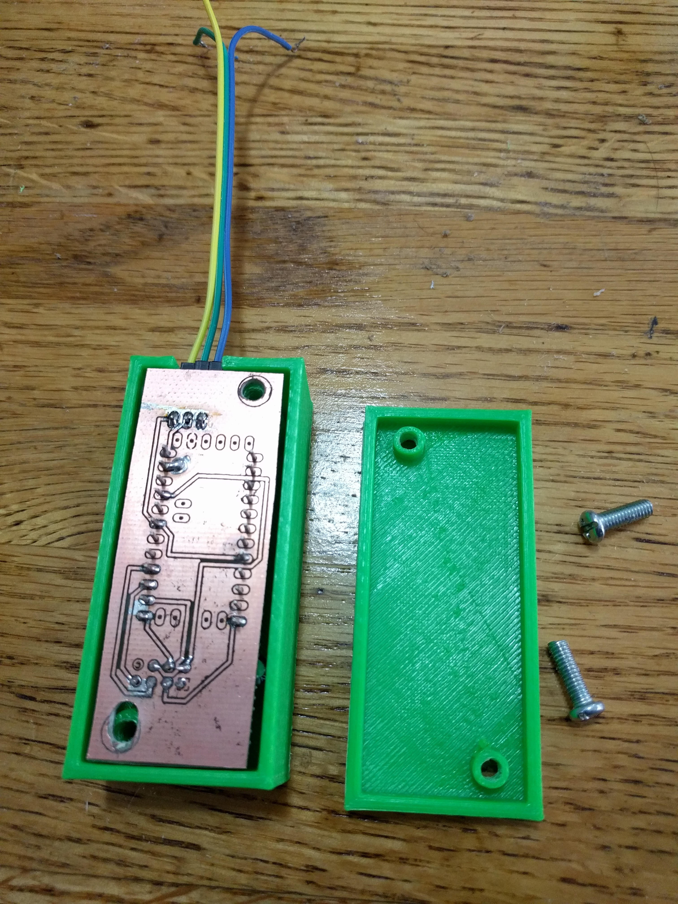

# eskatecontroller

This is a repository for the Arduino code and some CAD files for making PCBs for making a transmitter and receiver
for controlling throttle on an ESC.

Corresponding Thingiverse page http://www.thingiverse.com/thing:1864536

Related part for holding the batteries onto the bottom of the board and for covering the VESC and voltage/amperage display http://www.thingiverse.com/thing:2243206

In the Arduino folder there are two sub-folders one for the transmitter/controller and one for the receiver that gets the signal
and sends a PWM signal to an ESC.  The code has comments to explain what the parts do but key points are the transmitter expects
to read an analog signal from a potentiometer on pin A1 and the receiver expects to write a PWM signal to digital pin 5.

The PCB in the Eagle folder and corresponding Eagle files can be used for simplifying and solidifying the connections between
the battery, Arduino and RF module.  There is a PNG in the Images folder that can be printed using a laser printer and transferred
to a copper plate then etched to make a PCB at home, there are lots of instructions online on how to do this but not included
here.  Using the Eagle files one could also export files for a professional fabrication house to make them or forgo them
entirely.

<table>
<tr>
<td>

</td>
<td>

</td>
</tr>
<tr>
<td colspan="2">

</td>
</tr>
</table>

For the EagleCAD PCB the specific parts used are:

  - [Arduino Pro Mini 3.3V](https://www.amazon.com/Diymall-Atmega328-Atmega328p-Arduino-Esp8266/dp/B00NWF2DAU/)
  - [nRF24L01+ 2.4GHz Wireless Transceiver](https://www.amazon.com/gp/product/B00E594ZX0/)
