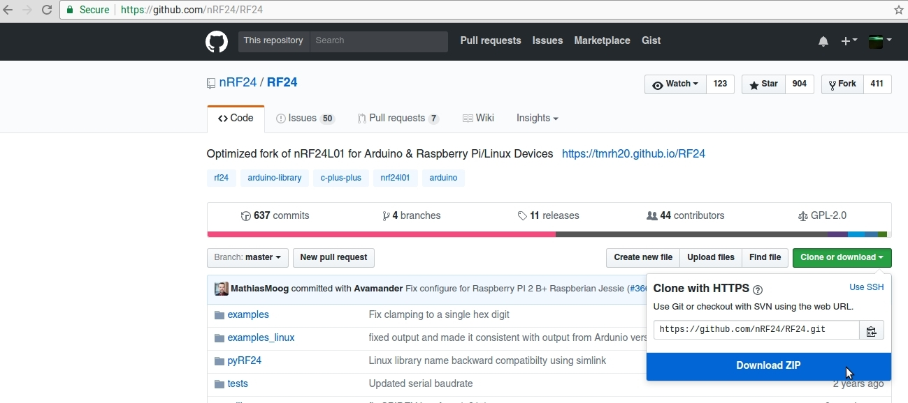

# eskatecontroller

This is a repository for the Arduino code and some CAD files for making PCBs for making a transmitter and receiver
for controlling throttle on an ESC.

Corresponding Thingiverse page http://www.thingiverse.com/thing:1864536

Related part for holding the batteries onto the bottom of the board and for covering the VESC and voltage/amperage display http://www.thingiverse.com/thing:2243206

Other related part remixed VESC case
http://www.thingiverse.com/thing:2263285

Another new part for the board, made an LED headlight/tailight holder that act as risers between the trucks and the board.
https://www.thingiverse.com/thing:2397920

In the Arduino folder there are two sub-folders one for the transmitter/controller and one for the receiver that gets the signal
and sends a PWM signal to an ESC.  The code has comments to explain what the parts do but key points are the transmitter expects
to read an analog signal from a potentiometer on pin A1 and the receiver expects to write a PWM signal to digital pin 5.

The PCB in the Eagle folder and corresponding Eagle files can be used for simplifying and solidifying the connections between
the battery, Arduino and RF module.  There is a PNG in the Images folder that can be printed using a laser printer and transferred
to a copper plate then etched to make a PCB at home, there are lots of instructions online on how to do this but not included
here.  Using the Eagle files one could also export files for a professional fabrication house to make them or forgo them
entirely.

<table>
<tr>
<td style="text-align:center">

</td>
<td style="text-align:center">

</td>
</tr>
<tr>
<td>

</td>
<td>

</td>
</tr>
<tr>
<td>

</td>
<td>

</td>
</tr>
<tr>
<td>

</td>
<td>

</td>
</tr>
</table>

For the EagleCAD PCB the specific parts used are:

  - [Arduino Pro Mini 3.3V](https://www.amazon.com/Diymall-Atmega328-Atmega328p-Arduino-Esp8266/dp/B00NWF2DAU/)
  - [nRF24L01+ 2.4GHz Wireless Transceiver](https://www.amazon.com/gp/product/B00E594ZX0/)

# Assembly Overview

For the PCBs made from PCBway the schematic is slightly different from what you can see from the at home PCB.  The main change is the analog pin for the potentiometer signal into the arduino was going to pin A1 before and has been moved to A2 just because I read up that some things can affect the ADC on A0 and A1 so figured I should just move it to A2 (that same line also connects to D5 which is only used on the receiver side).

There are two, three pin breakouts one marked for ESC and one marked for potentiometer.  For both of these three pin connections the ground is towards the center of the board and the power is through the middle of the three pins and the signal is the pin towards the outside edge of the board.

The ESC middle pin is power in to the RAW pin of the arduino a LiPo is enough to keep it running stable at the 8MHz speed down to below the safe level for the LiPo itself, get ones with built in cut off circuitry to avoid over discharge in the controller, cheap ones available for micro quads in 400 or 800mAh variety, have a 800 mAh one and it lasts a really long time, somewhere around 20mA of draw typically.  The POT middle pin is the 3.3V supply off the arduino.

On the controller/transmitter side you will use the ESC pins to put power into the RAW pin of the Arduino and to connect the ground (pin towards the middle).  The signal pin for the connection marked ESC won't be used in the controller.  The 3 pins for the potentiometer the middle is 3.3V from the arduino (left leg of potentiometer), the pin near the edge is the signal (middle leg of potentiometer typically), and the pin near the center of the PCB is ground (right leg of potentiometer typically). See image above.

Image below shows the way the other PCBs need to attach but in the case of the controller I actually put the arduino on the other side of the board and it is just "upside down" so the reset button and atmel chip are facing "down" at the PCB surface instead of away from it how it's pictured.  In the receiver it is done as pictured.

I rearranged them in the controller just to have a little space on each side vs all the components on one side.

# Assembly Steps
Basically solder the boards together in the arrangement shown.  Good to just solder all the outside rows of arduino pins to get a nice solid connection.  If you'd like you can verify the connections based on the PCB layout below (would share the schematic but sort of useless since I just named all the nets/wires and didn't actually draw connections, it was getting too messy to deal with).

[Note the two inside pins for the ESC and potentiometer appear to not be connected but they are connected to ground]

# Programming

To program the chips you'll need an FTDI breakout adapter that supports 3.3V.  Mine claimed to have 3.3V support but actually still puts 5V+ through the VCC pin and was frying the nrf chips after a few minutes of testing.  After I realized they were over voltage I started using a bench power supply or these 3.3V regulators to step down the 5V power before feeding it into the VCC for the sake of programming.

For the receiver side you can use the Arduino [project file](Arduino/rc_receiver/rc_receiver.ino) from the receiver folder without any modifications really.

For the [transmitter](Arduino/rc_controller/rc_controller.ino) side you'll need to adjust the [high/low](Arduino/rc_controller/rc_controller.ino#L19) values for the controller itself so this sort of needs to be done after assembly (when you actually know the low and high points of the potentiometer).  I had previously programmed it to get that input on startup by swinging it high and low and using those as min and max, but that seems less reliable in the long term and can lead to spinning out your motors when the value isn't set.  Anyhow long story short once assembled you will need to upload the code for the transmitter onto the arduino and then use the serial monitor to see what actual max/min values it reports and adjust the max/min in the code.

Specific steps for programming:

1. Download and install the Arduino IDE if you haven't already.

  https://www.arduino.cc/

  
2. Download and extract the RF24 library into your arduino libraries folder

  https://github.com/nRF24/RF24

  Extract it to the Arduino folder (mine is in /home/shaun/Arduino/libraries/RF24) do this while the IDE is closed.
  

3.  Download and extract this repository somewhere.
4.  Open the Arduino/rc_controller/rc_controller.ino file in the Arduino IDE
5.  Change line 5 from

`//#define DEBUGMODE`

to

`#define DEBUGMODE`

This will allow it to print data to the serial line to see what the high and low values should be.

6.  Connect the controller arduino using the FTDI->USB cable to the computer
7.  Upload the code.

8.  Check serial monitor and pull the trigger all the way to its maximum and minimum and note the values at the top and end (they will always be between 0-1024, if they go the wrong direction it doesn't really matter the value mapping will still work, but you can reverse the polarity on the potentiometer to correct that)
9.  Update the code  Lines 19 and 20 have the min and max, just set those to the values you saw and should be good to go (Arduino/rc_controller/rc_controller.ino#L19)
10. Upload the new code (can change line 66 from printing the `sensorValue` to printing the `mappedValue` so you can see that full trigger is 254, full brake is 1 and idle should be near 125).

Should be all set on the controller programming.  The ESC programming is luckily much easier, just get the boards connected, hook up the FTDI open the [receiver.ino](Arduino/rc_receiver/rc_receiver.ino), and upload the receiver code to the board.  When you connect the ESC pins on the receiver side you also won't use the POT breakout pins at all.

If you have issues or these instructions are unclear (cat stuck in toaster) let me know and will see if I can help.

---

Extra note for charging the LiPo can either use a TP4056 or just attach or keep attached the original balance lead.

---

MIT License

Copyright 2017 Shaun Husain

Permission is hereby granted, free of charge, to any person obtaining a copy of this software and associated documentation files (the "Software"), to deal in the Software without restriction, including without limitation the rights to use, copy, modify, merge, publish, distribute, sublicense, and/or sell copies of the Software, and to permit persons to whom the Software is furnished to do so, subject to the following conditions:

The above copyright notice and this permission notice shall be included in all copies or substantial portions of the Software.

THE SOFTWARE IS PROVIDED "AS IS", WITHOUT WARRANTY OF ANY KIND, EXPRESS OR IMPLIED, INCLUDING BUT NOT LIMITED TO THE WARRANTIES OF MERCHANTABILITY, FITNESS FOR A PARTICULAR PURPOSE AND NONINFRINGEMENT. IN NO EVENT SHALL THE AUTHORS OR COPYRIGHT HOLDERS BE LIABLE FOR ANY CLAIM, DAMAGES OR OTHER LIABILITY, WHETHER IN AN ACTION OF CONTRACT, TORT OR OTHERWISE, ARISING FROM, OUT OF OR IN CONNECTION WITH THE SOFTWARE OR THE USE OR OTHER DEALINGS IN THE SOFTWARE.
